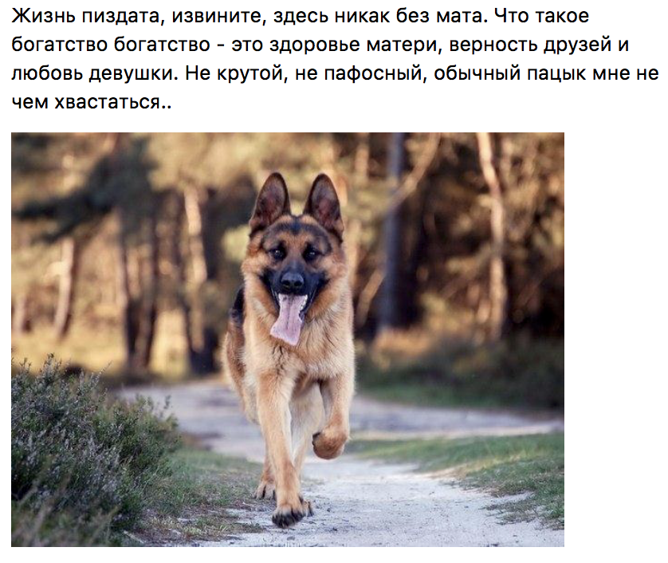

# markov-chains-sentence-generator

## Usage

```
String quotes = "quotes.txt";
String pictures = "pictures.txt";
int lowerEnclosure = 8;
int upperEnclosure = 30;
int lowerWordNumber = 20;
int upperWordNumber = 50;

PostGenerator pg = new PostGenerator(quotes, pictures", lowerEnclosure, upperEnclosure, lowerWordNumber, upperWordNumber);

String[] post = pg.generatePost();

for (int i = 0; i < post.length; i++) {
  System.out.println(post[i]);
}
```
## Variables

**quotes** - Full filename to take sentence examples from (each sentence must be on the new line).

**pictures** - Full filename to take image links from (each image link must be on the new line).

**lowerEnclosure** - Minimal number of markov chains enclosure. The lower this value, the less sense in generation results.

**upperEnclosure** - Maximal number of markov chains enclosure. The lower this value, the less sense in generation results.

**lowerWordNumber** - Minimal number of words in generated sentences.

**upperWordNumber** - Maximal number of words in generated sentences.

## Some examples in russian after parsing of five VK public pages

  
  
  
  
  
